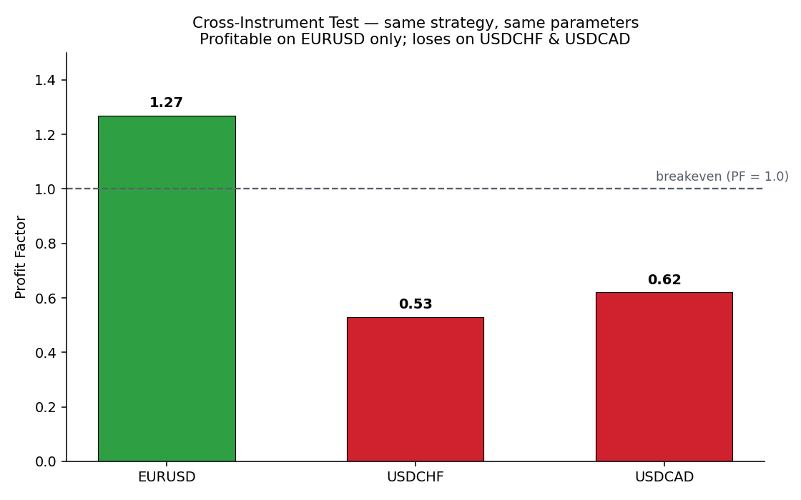
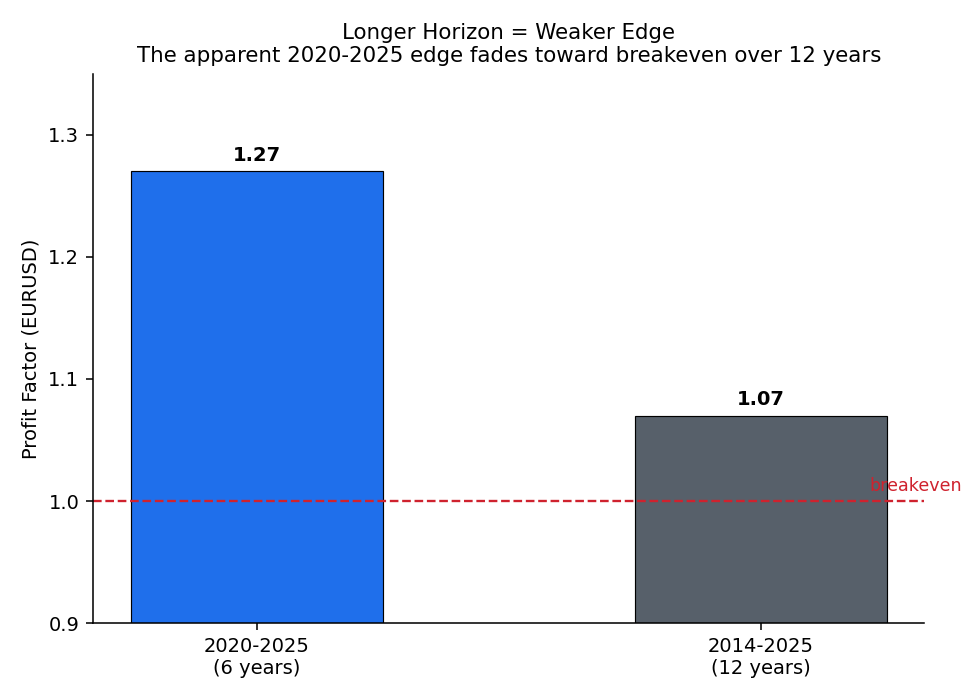

# Empirical Results (MetaTrader 5, real tick data)

All figures below are from the **MetaTrader 5 Strategy Tester** using
**"Every tick based on real ticks"** modelling and **History Quality 100%**,
initial deposit 10,000, mean-reversion strategy, **long-only**. These are the
real results the study is based on — not the synthetic demo.

---

## 1. Baseline — EURUSD, 2020–2025 (looks strong)

| Metric | Value |
|--------|-------|
| Net Profit | **+582.97** (+5.83%) |
| Profit Factor | **1.27** |
| Recovery Factor | **2.85** |
| Sharpe Ratio | **5.59** |
| Max Equity Drawdown | **2.01%** (204.20) |
| Total Trades | 197 |
| Win Rate | 42.13% |
| Avg Win / Avg Loss | 33.06 / −18.96 (RR ≈ 1.74) |
| Max Consecutive Losses | 9 |

On EURUSD alone, the strategy has a **positive expectancy** (a sub-50% win rate
is more than offset by a reward:risk near 1.74) and a low, controlled drawdown.
Taken in isolation, this backtest looks like a deployable edge.

**This is exactly the trap.** A single good backtest on a single instrument is
not evidence of an edge. The next two tests are what matter.

---

## 2. Cross-instrument test — the decisive check

The **same strategy with the same parameters**, applied to two other major FX
pairs over the same period:

| Instrument | Net Profit | Profit Factor | Verdict |
|-----------|-----------:|--------------:|---------|
| EURUSD | **+583** | **1.27** | ✅ profitable |
| USDCHF | −314 | 0.53 | ❌ loses |
| USDCAD | −235 | 0.62 | ❌ loses |

If the edge were a genuine, general market property (e.g. "ranging FX pairs
mean-revert"), it should show up — at least weakly — on other ranging pairs.
It does not. It is **profitable on EURUSD and loses money everywhere else**.
That is the signature of a strategy fitted to one instrument's historical
quirks, not a durable edge.

---

## 3. Longer-horizon test — the edge decays

Extending the EURUSD backtest from 6 years to 12 years:

| Period | Net Profit | Profit Factor | Recovery Factor |
|--------|-----------:|--------------:|----------------:|
| 2020–2025 (6 yr) | +583 | **1.27** | 2.85 |
| 2014–2025 (12 yr) | +88 | **1.07** | 0.29 |

Over the longer window the profit factor collapses toward **1.07 (essentially
breakeven)** and the recovery factor drops to 0.29. The apparent edge was
concentrated in the 2020–2025 regime and does not persist. This is an
inadvertent out-of-sample test, and it agrees with the cross-instrument result.

---

## Conclusion

Three independent tests point the same way:

1. EURUSD 2020–2025 in isolation → looks good (PF 1.27)
2. Same strategy on USDCHF / USDCAD → loses money (PF 0.53 / 0.62)
3. EURUSD over 12 years → decays to breakeven (PF 1.07)

The strategy is **not deployable**. The edge is specific to one instrument in
one period — it does not generalise across instruments or survive a longer
horizon. The correct, evidence-based decision is to **reject it**.

The value of this project is the framework that produced this conclusion and
the discipline to act on it — the same judgement that separates a usable
machine-learning model from an overfit one that fails in production.
